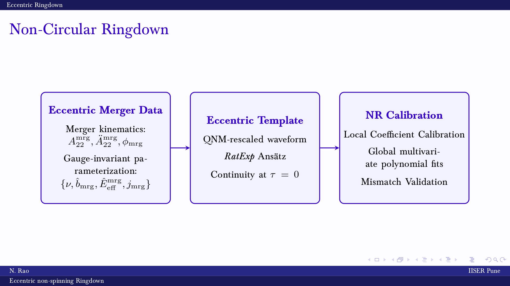

# Highly eccentric non-spinning binary black hole mergers: quadrupolar post-merger waveforms
Nishkal Rao <sup>1</sup>, Gregorio Carullo <sup>2</sup>

<sub>1.Department of Physics, Indian Institute of Science Education and Research, Pashan, Pune - 411 008, India</sub>  
<sub>2.School of Physics and Astronomy and Institute for Gravitational Wave Astronomy, University of Birmingham, Edgbaston, Birmingham, B15 2TT, United Kingdom</sub>  

## Introduction
We present numerically-informed closed-form expressions for the dominant $(\ell,m)=(2,2)$ waveform harmonic of the post-merger emission from mergers of non-spinning binary black holes with comparable masses on highly eccentric orbits. Using 233 non-spinning eccentric simulations from the RIT catalog, we construct time-dependent complex quasinormal mode amplitudes via a Bayesian procedure. We build multivariate polynomial models, represented as functions of the symmetric mass ratio $\nu$ and two gauge-invariant merger parameters: the mass-rescaled effective energy $\hat{E}_{\mathrm{eff}}^{\mathrm{mrg}}$ and the angular momentum $j_{\mathrm{mrg}}$. We further validate the post-merger non-circular waveform model by comparing it against simulations from the SXS catalog. Our models achieve mismatches around $\lesssim10^{-3}$, including for near-extreme eccentricities. The model can be directly combined with effective-one-body and phenomenological inspiral waveforms to produce accurate inspiral-merger-ringdown waveforms, essential for parameter estimation of both astrophysical and fundamental physics properties of the signals' sources.

## Paper
[arXiv:2604.15431](https://arxiv.org/abs/2604.15431)

### Usage

We have the sequential steps to construct the post-merger waveform model as follows:
1. **Eccentric Merger Data**: Using the python script: [`extract_merger_quantities.py`](https://github.com/GCArullo/eccentric_fits/blob/main/scripts/extract_merger_quantities.py) from the repository at [eccentric_fits](http://github.com/GCArullo/eccentric_fits), we extract the gauge-invariant merger parameters $\hat{E}_{\mathrm{eff}}^{\mathrm{mrg}}$ and $j_{\mathrm{mrg}}$ for the 233 non-spinning eccentric simulations from the RIT catalog. We also extract the amplitude, frequency at the merger, and their derivatives. The extracted properties are stored in the file: ['RIT_Parameters_non-spinning.csv'](src/data/RIT_Parameters_non-spinning.csv) in the repository. The script to extract the merger parameters can be used for any other set of simulations, and the extracted parameters can be used to construct the global fits for those simulations as well.
2. **Eccentric Template**: The local fits pertaining to the median extraction of the coefficients are constructed at the directory: ['nc_fits_rit_non-spinning'](src/scripts/nc_fits_rit_non-spinning) using ['bayRing'](https://github.com/GCArullo/bayRing), and the medians are extracted and the global fits are constructed using the python script: ['fit_merger_ringdown_quantities.py'](https://github.com/GCArullo/eccentric_fits/blob/main/scripts/fit_merger_ringdown_quantities.py) from the repository at [eccentric_fits](http://github.com/GCArullo/eccentric_fits). The global fits are represented as multivariate polynomials in $\nu$, $\hat{E}_{\mathrm{eff}}^{\mathrm{mrg}}$ and $j_{\mathrm{mrg}}$. The specific form of the global fit is given in the paper. The local fits are used to extract the median values of the coefficients, which are then used to construct the global fits.
3. **NR Calibration**: The global fits thus calibrated, are validated against the RIT simulations. The mismatch is computed using the scripts at the directory: ['bayesian_global_fits'](src/scripts/bayesian_global_fits) using ['bayRing'](https://github.com/GCArullo/bayRing), with setting the template to the global fit as mentioned below. 

We present the global fit coefficients in the file: ['order_fits_nu_emrg_bmrg_3.csv'](src/data/bayesian_fit_coefficients/order_fits_nu_emrg_bmrg_3.csv) in the repository. The global fit coefficients in the ['bayesian_fit_coefficients'](src/data/bayesian_fit_coefficients) directory are represented as multivariate polynomials in $\nu$, $\hat{E}_{\mathrm{eff}}^{\mathrm{mrg}}$, $\hat{b}_{\mathrm{mrg}}$ and $j_{\mathrm{mrg}}$. 

To reproduce the plots in the paper, we use the notebooks in [notebooks](notebooks) directory. The notebook [`rit_non-spinning.ipynb`](notebooks/rit_non-spinning.ipynb) contains the global fit and mismatch plots. The specific case waveforms are plotted in [`rit_waveform.ipynb`](notebooks/rit_waveform.ipynb). The notebook [`waveforms.ipynb`](notebooks/waveforms.ipynb) contains the global fit waveforms.

For sample configs, check the directory: ['tests'](src/tests).

To use the template, use the following configuration in ['pyRing`](https://lscsoft.docs.ligo.org/pyring/):
```python
[I/O]
outdir            = {output_directory}
screen-output     = 0

[NR-data]
catalog           = RIT
ID                = {id}
l-NR              = 2
m                 = 2            
error             = late-time-const-error
properties-file   = nc_ringdown/src/data/RIT_Parameters_non-spinning.csv    # file containing the merger parameters for the RIT non-spinning simulations
fits-file         = nc_ringdown/src/data/bayesian_fit_coefficients/order_fits_nu_emrg_bmrg_3.csv    # file containing the global fit coefficients for the post-merger template

[Model]
template          = TEOBPM
TEOB-template     = RatExp      # specifies that the non-circular RatExp template is used for the post-merger
TEOB-global-fit   = 1           # specifies that the global fits are used for the post-merger template
TEOB-merger-data  = 1           # specifies that the merger parameters are extracted from the NR data and used for the global fits, instead of QC fits

[Inference]
nlive             = 128
maxmcmc           = 128
t-start           = 0
seed              = 1

[Priors]
```

## License and Citation


This work is licensed under a [Creative Commons Attribution-ShareAlike 3.0 United States License](http://creativecommons.org/licenses/by-sa/3.0/us/).

We encourage use of these data in derivative works. 
